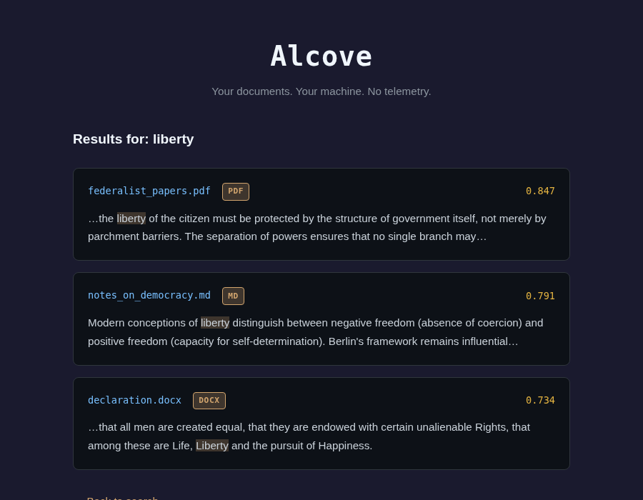

<p>
  <a href="https://github.com/Pro777/alcove/actions/workflows/ci.yml"></a>
  <a href="https://pypi.org/project/alcove-search/"></a>
  <a href="https://pypi.org/project/alcove-search/"></a>
  <a href="https://github.com/Pro777/alcove/blob/main/LICENSE"></a>
</p>

**Alcove** is a local-first document search library. Install it, point it at your files, and search. No server, no sign-up, no data leaves your disk.

## ✨ Features

- **🔒 Private** — documents stay on your machine, no cloud calls, no telemetry
- **⚡ Zero config** — `pip install`, two commands, searching in under a minute
- **🔌 Extensible** — custom extractors, embedders, and vector backends
- **📄 Multi-format** — PDF, EPUB, HTML, Markdown, CSV, JSON, JSONL, DOCX, TXT
- **🌐 Web UI** — upload and search from your browser

## 📦 Installation

**Requirements:** Python 3.10+ · Linux, macOS, or Windows

```bash
pip install alcove-search
```

## ⚡ Quick Start

```bash
alcove seed-demo          # download sample corpus + build index
alcove serve              # open http://localhost:8000
```



> [Watch the 30-second CLI demo](https://pro777.github.io/alcove/demo.html)

## 🔒 Trust Model

- Local disk only — no hosted control plane
- No telemetry. Period. (ChromaDB's upstream telemetry is also disabled.)
- You choose what enters your index
- **We do not want your data**

## 📚 Documentation

- [Architecture](docs/ARCHITECTURE.md)
- [Operations](docs/OPERATIONS.md)
- [Security](docs/SECURITY.md)
- [Seed Corpus](docs/SEED_CORPUS.md)
- [Roadmap](docs/ROADMAP.md)

## 📄 License

[MIT](LICENSE)
