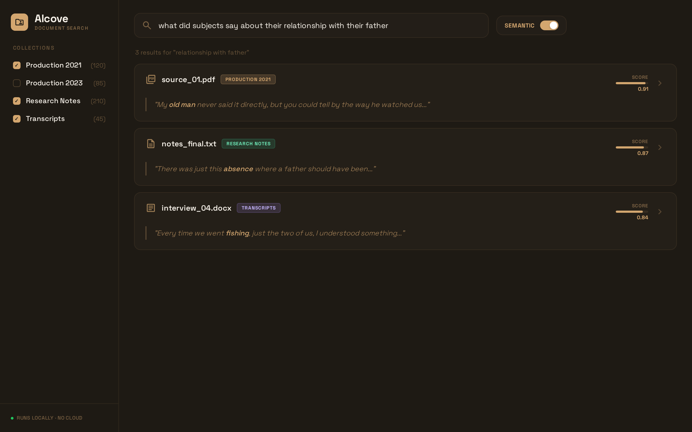
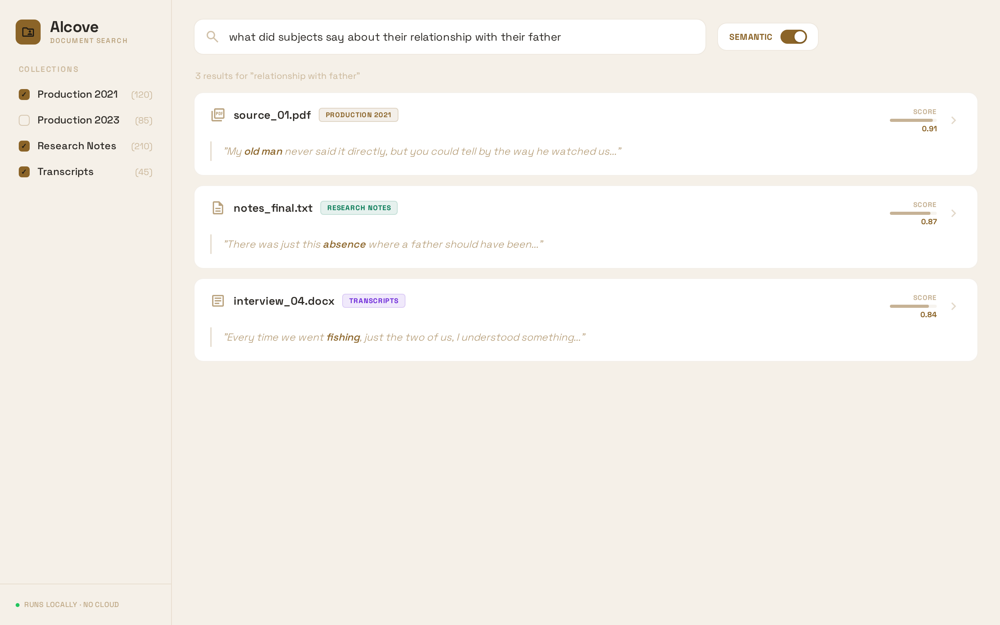

<p>
  <a href="https://github.com/Spitfire-Cowboy/alcove/actions/workflows/ci.yml"></a>
  <a href="https://codecov.io/gh/Spitfire-Cowboy/alcove"></a>
  <a href="https://pypi.org/project/alcove-search/"></a>
  <a href="https://pypi.org/project/alcove-search/"></a>
  <a href="https://github.com/Spitfire-Cowboy/alcove/blob/main/LICENSE"></a>
</p>

**Index your world. Share it with the universe.**

---

Every AI tool needs your data to be useful. The default answer is: upload it, hand it over, hope for the best. Alcove is the other answer.

Alcove is a search engine that runs on your machine, indexes your files, and never sends a byte anywhere. Your documents stay on your disk. The search index stays on your disk. When you search, or when an AI tool needs to look something up, Alcove answers from what you have locally. No cloud. No account. No trust required.

**[See it in 30 seconds](https://spitfire-cowboy.github.io/alcove/demo.html)** · [Why Alcove?](WHY.md)

## How it works

Three stages. Each is independent, each reads from disk and writes to disk, each can be re-run without touching the others.

```
data/raw/*  →  chunks.jsonl  →  vector store  →  search results
```

**Ingest** discovers files recursively and extracts text with format-specific extractors. PDF, EPUB, HTML, Markdown, CSV, JSON, JSONL, DOCX, RST, TSV, and plain text all work out of the box.

**Index** embeds the chunks and writes them to a local vector store. ChromaDB is the default backend; zvec is available where a lighter footprint matters.

**Query** retrieves results through the CLI or a built-in web interface with file upload. Three search modes: semantic (vector similarity), keyword (BM25), and hybrid. Results can be scoped to named collections.

Fixed pipeline, variable corpus. Custom extractors, embedders, and vector backends plug in via Python entry points. See [Architecture](docs/ARCHITECTURE.md) for the full plugin API and [Plugin Ideas](docs/PLUGINS.md) for domain-specific use cases.

## Quick start

```bash
pip install alcove-search[semantic]
```

This pulls in sentence-transformers for real vector similarity (~80 MB model download on first use). The base package without `[semantic]` uses the hash embedder: useful for development and CI, but not for meaningful search.

<details>
<summary>All install extras</summary>

| Extra | Install command | What it adds |
|-------|----------------|--------------|
| Semantic search | `pip install alcove-search[semantic]` | Real vector similarity via sentence-transformers |
| EPUB support | `pip install alcove-search[epub]` | `.epub` file ingestion |
| DOCX support | `pip install alcove-search[docx]` | `.docx` file ingestion |
| Everything | `pip install alcove-search[semantic,epub,docx]` | All of the above |

</details>

```bash
alcove seed-demo          # download sample corpus + build index
alcove serve              # open http://localhost:8000
```

<table><tr>
<td><a href="docs/assets/web-ui-dark.png"></a></td>
<td><a href="docs/assets/web-ui-light.png"></a></td>
</tr></table>

## The trust dial

You choose your comfort level with ML. Both modes run the same pipeline, produce the same output format, and respect the same boundary: nothing leaves the machine.

**Hash embedder (default):** Deterministic SHA-256. No ML model. No network activity. Every output is a pure function of the input. This is for operators who do not want machine learning anywhere near their corpus.

**Sentence-transformers (opt-in):** Real vector similarity via a local neural model, downloaded once. Still fully local. Still no cloud. This is retrieval, not generation: it finds documents that are semantically close to your query. It does not write, invent, or editorialize.

## Trust model

Local disk only. No outbound network calls. No telemetry. No account to create. We disabled ChromaDB's upstream telemetry too.

**We do not want your data.**

This is not a feature. It is a structural constraint. The architecture assumes you own your hardware, you control your storage, and you decide what enters the index. There is no flag to turn this off because there is nothing to turn off. The boundary is the architecture.

Alcove stores everything on your disk because that is where your data already lives. Moving it somewhere else to search it was always the strange decision.

## Where it is going

v0.3.0 is a working search platform. That is the "index your world" part.

The "share it with the universe" part comes next: a retrieval interface that lets external tools query your index, on your terms. Your files stay local. Your index stays yours. But if you choose to open a door, AI gets real answers from your actual documents. No hallucinations, because there is no generation. Just lookup.

Beyond that: streaming ingest, browsable corpus navigation, cross-modal indexing, a relevance layer that treats memory more like memory and less like a distance calculation, and federated indexes that let separate Alcove instances share a query surface without sharing raw data.

The full roadmap is in [docs/ROADMAP.md](docs/ROADMAP.md). Alcove will not become a SaaS product. The architecture assumes the operator owns the hardware.

## Documentation

[Why Alcove?](WHY.md) · [Architecture](docs/ARCHITECTURE.md) · [Operations](docs/OPERATIONS.md) · [Security](docs/SECURITY.md) · [Seed Corpus](docs/SEED_CORPUS.md) · [Roadmap](docs/ROADMAP.md) · [Plugin Ideas](docs/PLUGINS.md) · [Homebrew Packaging](docs/HOMEBREW.md) · [Accessibility](ACCESSIBILITY.md)

## License

[Apache 2.0](LICENSE)

---

*The word [alcove](https://en.wikipedia.org/wiki/Alcove_(architecture)) comes from Arabic* القبة *(al-qubbah) — "the vault." An enclosed, protected space for things that matter.*
